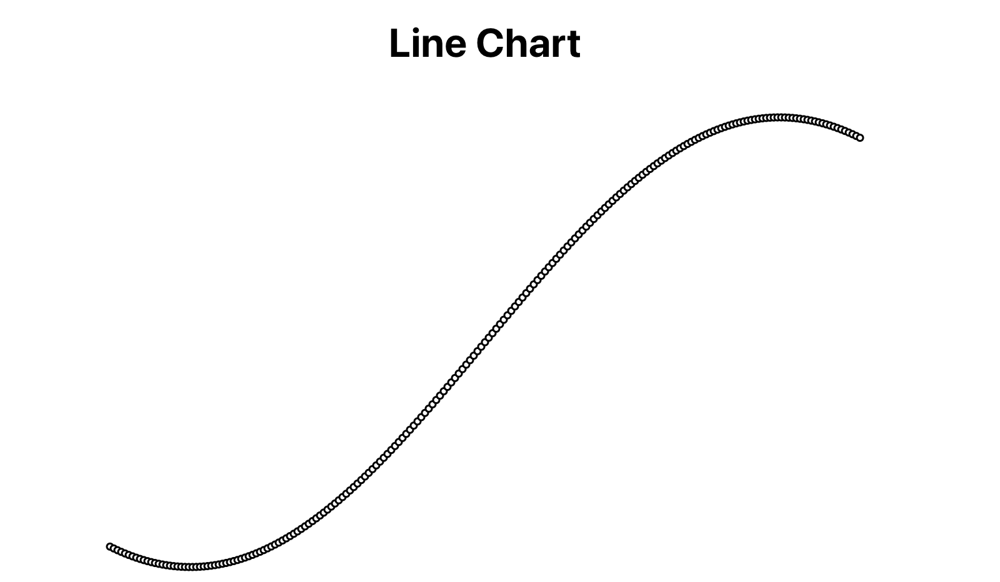

#### Concepts covered here 
***scaleLinear***  method takes domain and range as parameter, and create a visual scale point. scale function that maps a continuous input domain to a continuous output range using a linear transformation

***extend*** method returns the min and max value in array form.

#### Concepts covered here 

***scaleBand*** is a type of scale specifically used for discrete, categorical data. It maps a set of categories (e.g., country names, product types) to a range of visual positions, such as along an axis in a chart.

***call*** function is a utility method used to simplify the application of reusable functions or code blocks to a D3 selection. It helps modularize code by applying custom behaviors and transformations.

#### Concepts covered here 

***arc*** generator is used to create SVG paths that represent arcs or segments of circles. It is commonly used in visualizations such as pie charts and donut charts. defining complex paths by calculating the necessary path data based on parameters such as start and end angles, inner and outer radii

****Inner Radius (innerRadius):**** The radius of the inner circle. For pie charts, this is typically 0. For donut charts, this value creates a hollow center.
****Outer Radius (outerRadius):**** The radius of the outer circle that forms the boundary of the arc.
