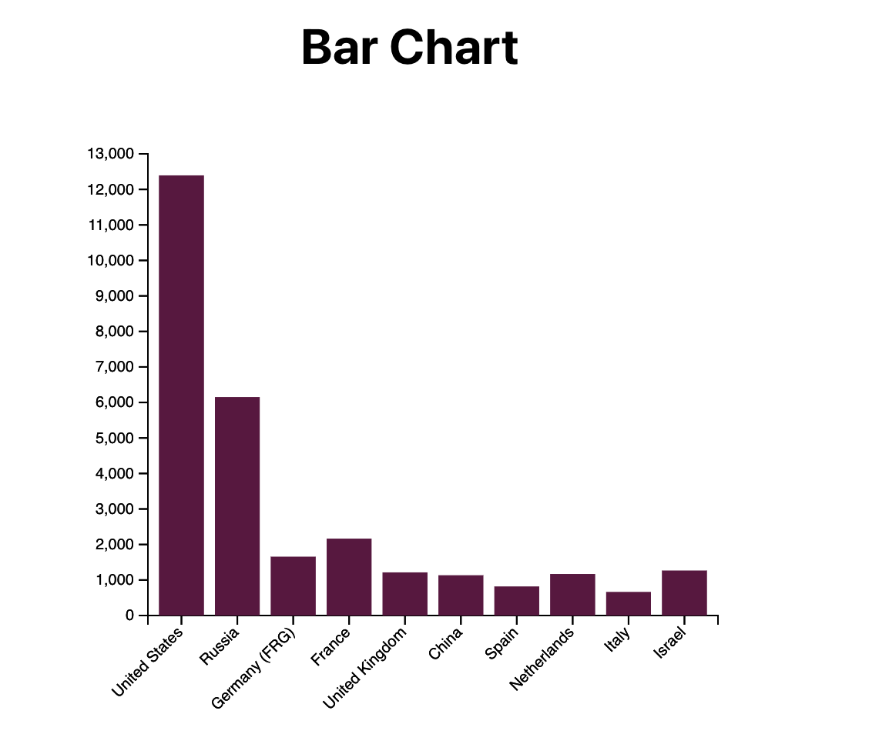
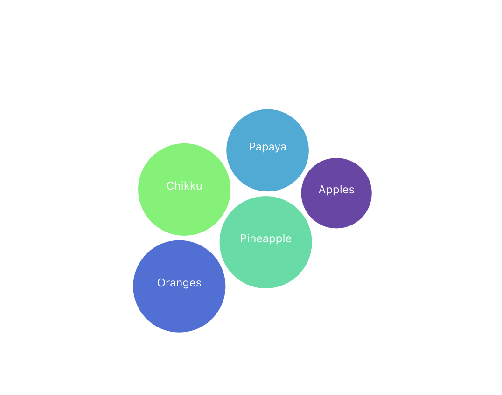
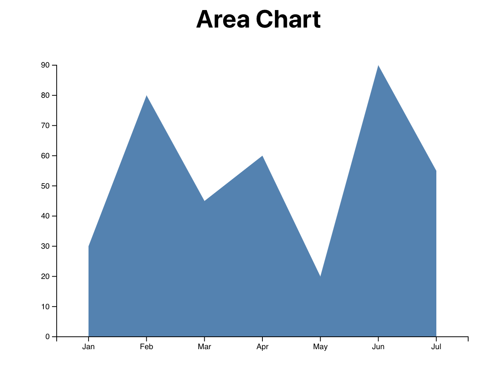

## <ins>Line Charts</ins>

#### Concepts covered here 
***scaleLinear***  method takes domain and range as parameter, and create a visual scale point. scale function that maps a continuous input domain to a continuous output range using a linear transformation

***extend*** method returns the min and max value in array form.

## <ins>Bar Charts</ins>

#### Concepts covered here 

***scaleBand*** is a type of scale specifically used for discrete, categorical data. It maps a set of categories (e.g., country names, product types) to a range of visual positions, such as along an axis in a chart.

***call*** function is a utility method used to simplify the application of reusable functions or code blocks to a D3 selection. It helps modularize code by applying custom behaviors and transformations.

## <ins>Pie Charts</ins>

#### Concepts covered here 

***arc*** generator is used to create SVG paths that represent arcs or segments of circles. It is commonly used in visualizations such as pie charts and donut charts. defining complex paths by calculating the necessary path data based on parameters such as start and end angles, inner and outer radii

****Inner Radius (innerRadius):**** The radius of the inner circle. For pie charts, this is typically 0. For donut charts, this value creates a hollow center.
****Outer Radius (outerRadius):**** The radius of the outer circle that forms the boundary of the arc.

***pie*** function, which is a layout generator used for creating data suitable for pie charts. The function takes in an array of data and returns an array of objects, each representing a slice of the pie. Each object contains start and end angles that can be passed to an arc generator to draw the corresponding slice.

***padAngel*** create a small gap between each slice of the pie or donut chart. This makes the chart more readable by clearly delineating each segment.

***value*** function can be used to return the value of object.

## <ins>Bubble Charts</ins>

***scaleSequential*** This creates a sequential scale, which is used for continuous input data. The output is a color based on a gradient defined by the interpolator.

***interpolator(d3.interpolateCool)*** This sets the color interpolation function that defines the range of colors the scale will output.
interpolateCool is one of the built-in interpolator functions in D3 that produces a color gradient ranging from light blue to purple. It provides a visually appealing set of colors that transition smoothly.

## <ins>Area Charts</ins>

#### Concepts covered here 

***area*** function is used to create an area generator.The area generator produces an SVG path string from data points, which can be used to create an area chart.

`<path fill="steelblue" d="M41.056,233.333L115.704,38.889L190.352,175L265,116.667L339.648,272.222L414.296,0L488.944,136.111L488.944,350L414.296,350L339.648,350L265,350L190.352,350L115.704,350L41.056,350Z"></path>`

The d3.area() function generates the d attribute of the <path> element, which defines the shape of the area.

***datum*** function is used to bind a single data point (or a single data object) to a selected DOM element. This is different from the data() function, which binds an array of data to a selection of multiple elements.
